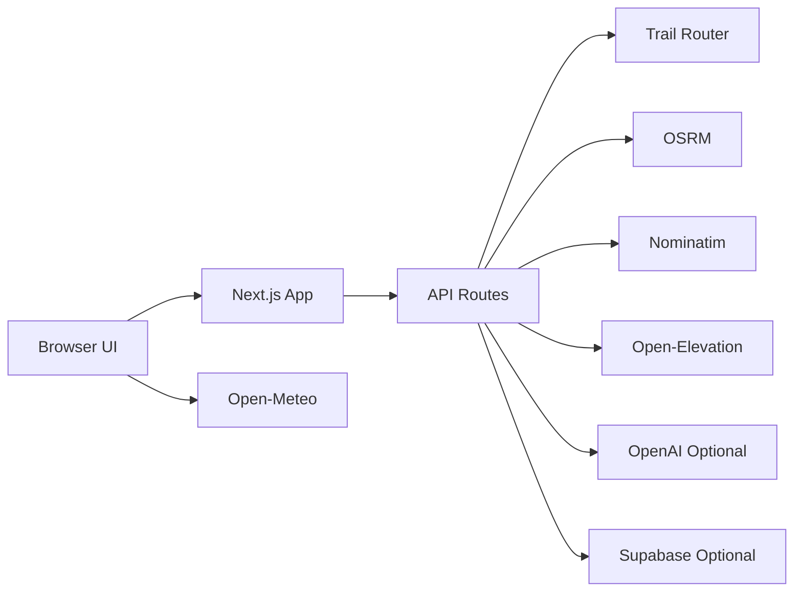

# runnr — System Design (One Pager)

## What this app does
runnr lets a user pick a start point, choose run preferences (distance/elevation/surface/safety), and generate route options on a map. Users can then export routes (GPX/Google Maps), save/share routes, and optionally use AI-enhanced route naming/ranking.

## Architecture at a glance

## Core flow (Generate Route)
1. User sets start point (map click, address search, or **Use my location** with reverse geocode).
2. User configures trip type, distance, and run settings in the sidebar.
3. Frontend sends request to `POST /api/routes`.
4. Backend tries:
   - **Trail Router first** for roundtrip quality loops.
   - **OSRM fallback** if needed (or for one-way).
5. Backend returns up to 3 route options.
6. Frontend **sorts client-side** (recommended / closest / shortest / longest / fastest), shows compare cards, pace-based times, map polylines, and picks default or AI-recommended route.

## Route quality and intelligence
- **AI optional** (`OPENAI_API_KEY`): improves names, descriptions, tips, and ranking when present.
- **No AI key**: app still works; routes use standard Option A/B/C output and **client-side sort** (no preference/rank-by fields).
- **Pace comparison**: user sets pace (min/km or min/mi); sidebar compare cards show distance, your time, map estimate, and vs-target delta.
- **Elevation profile**: route samples sent to `POST /api/elevation`.
- **Weather badge**: fetched client-side from Open-Meteo.

## Save/share model
- Save route set via `POST /api/routes/save` → Supabase `saved_routes` (requires valid Supabase env + schema).
- List page hydrates IDs from `localStorage` via `POST /api/routes/saved` and prunes stale entries.
- Shared route page: `/routes/saved/[id]` with dynamic OG image for link previews.
- Feedback endpoint stores thumbs/tags in `route_feedback`.
- Local browser cache: recent starts (`runnr:recent-starts`) and saved-route metadata (`runnr:saved-routes`).

## Main API endpoints
- `POST /api/routes` — generate route options
- `GET /api/geocode` — address search or reverse geocode (`?q=` or `?lat=&lon=`)
- `POST /api/elevation` — elevation samples
- `POST /api/routes/save` — save route set
- `POST /api/routes/saved` — fetch multiple saved routes by ID (list hydration)
- `GET /api/routes/saved/[id]` — fetch saved route
- `DELETE /api/routes/saved/[id]` — delete saved route
- `POST /api/routes/saved/[id]/feedback` — submit feedback

## Key frontend areas
- `src/app/routes/routes-client.tsx` — main route builder (sectioned sidebar: trip type, locations, run settings, results, save/export)
- `src/app/routes/route-compare-table.tsx` — compact route comparison cards
- `src/app/api/routes/route.ts` — primary route generation backend
- `src/app/routes/saved/*` — saved route list/detail views + OG image
- `src/app/routes/export/page.tsx` — export help instructions
- `public/manifest.json` — PWA install metadata

## Tech stack
- Next.js (App Router), React, TypeScript
- Tailwind CSS + CSS variables (light/dark theme)
- Leaflet (`react-leaflet`)
- Trail Router + OSRM
- Optional: OpenAI + Supabase

## Mental model
**UI layer** (map + controls) -> **Routing layer** (Trail Router/OSRM) -> **Enhancement layer** (AI + save/share).
