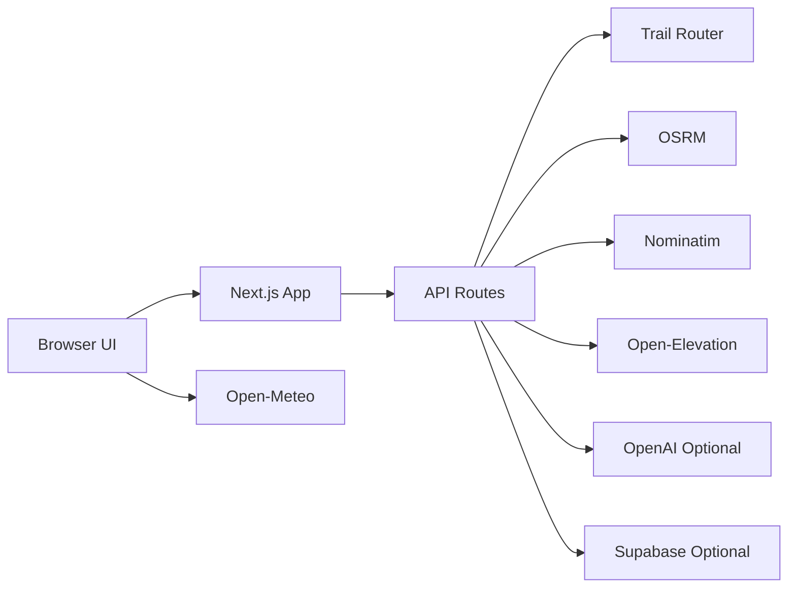

# runnr — System Design (One Pager)

## What this app does
runnr lets a user pick a start point, choose run preferences (distance/elevation/surface/safety), and generate route options on a map. Users can then export routes (GPX/Google Maps), save/share routes, and optionally use AI-enhanced route naming/ranking.

## Architecture at a glance

## Core flow (Generate Route)
1. User sets start point (map click or address search).
2. Frontend sends request to `POST /api/routes`.
3. Backend tries:
   - **Trail Router first** for roundtrip quality loops.
   - **OSRM fallback** if needed (or for one-way).
4. Backend returns up to 3 route options.
5. Frontend shows options, map polylines, and picks default/AI-recommended route.

## Route quality and intelligence
- **AI optional** (`OPENAI_API_KEY`): improves names, descriptions, tips, and ranking.
- **No AI key**: app still works with standard Option A/B/C output.
- **Elevation profile**: route samples sent to `POST /api/elevation`.
- **Weather badge**: fetched client-side from Open-Meteo.

## Save/share model
- Save route set via `POST /api/routes/save`.
- Stored in Supabase (`saved_routes`).
- Shared route page: `/routes/saved/[id]`.
- Feedback endpoint stores thumbs/tags in `route_feedback`.
- Local browser cache stores recent starts and lightweight saved-route metadata.

## Main API endpoints
- `POST /api/routes` — generate route options
- `GET /api/geocode` — address to coordinates
- `POST /api/elevation` — elevation samples
- `POST /api/routes/save` — save route set
- `GET /api/routes/saved/[id]` — fetch saved route
- `POST /api/routes/saved/[id]/feedback` — submit feedback

## Key frontend areas
- `src/app/routes/routes-client.tsx` — main route builder UX
- `src/app/api/routes/route.ts` — primary route generation backend
- `src/app/routes/saved/*` — saved route list/detail views
- `src/app/routes/export/page.tsx` — export help instructions

## Tech stack
- Next.js (App Router), React, TypeScript
- Tailwind CSS
- Leaflet (`react-leaflet`)
- Trail Router + OSRM
- Optional: OpenAI + Supabase

## Mental model
**UI layer** (map + controls) -> **Routing layer** (Trail Router/OSRM) -> **Enhancement layer** (AI + save/share).
